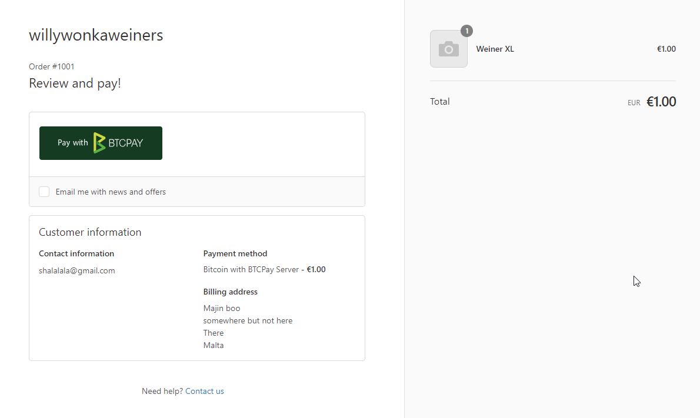
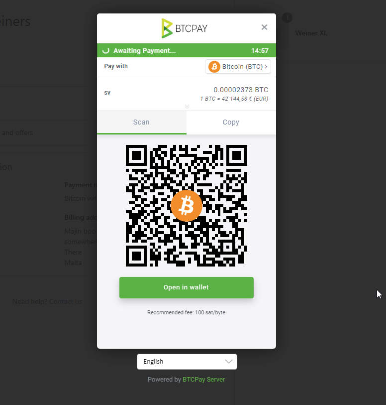
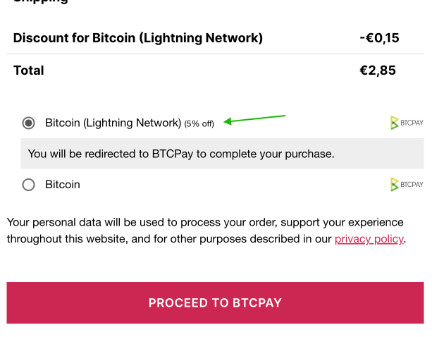
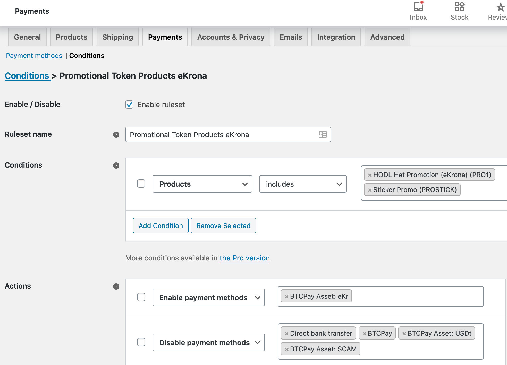
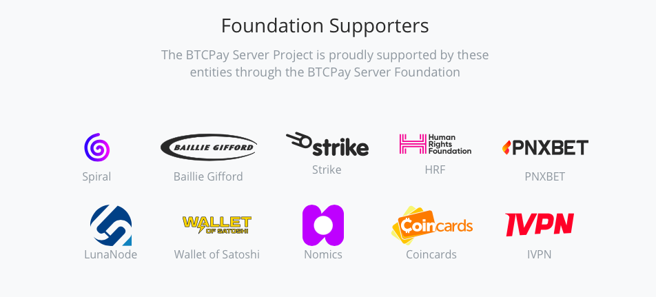

# BTCPay Server eCommerce integrations


@ndeet, estimated block height #752730

---

# History has been made


---

# BitPay compatible API

## Features
* make BitPay obsolete
* drop in replacement for merchants
* checkout/payments
* IPN callback notifications (insecure payload)

---

# Greenfield API


---

# The future
## Greenfield API

### Features
* modern REST API
* easy API key setup
* well documented using openAPI (Swagger)
* webhooks/event with signed payload
* managing wallets, pull payments/payouts (for refunds)
* more detailed information
* payment requests
* and much more: Node/Apps/User/Store management, ...


---

# eCommerce integrations

- Shopify *
- WooCommerce *
- Magento 2 *
- PrestaShop *
- Zapier *
- VirtueMart *
- OpenCart (soon) *
- Drupal Commerce
- Shopware

\* using Greenfield API

---



---



---

# Common use cases

* Basic checkout flow
* Receiving notifications (IPN) / webhook events

---

# Other interesting use cases

* separate payment methods
  - payment method based discounts, vouchers, ...
* no-redirect payment
* refunds, pull payments
* subscriptions via payment requests
* automations (Zapier)

---

# WooCommerce

## Separated payment gateways (payment methods)

- discount on payment gateways
- promotion tokens as vouchers

See: [https://docs.btcpayserver.org/FAQ/Integrations/#woocommerce-faq](https://docs.btcpayserver.org/FAQ/Integrations/#woocommerce-faq)

---

## WooCommerce: discounts on payment gateways



---

## WooCommerce: promotion tokens as vouchers

e.g. Blockstream Jade, token from presale used to claim product



---

# Custom integrations with Greenfield API


## Libraries
- C#
- PHP (btcpayserver-greenfield-php on packagist.org)
- JavaScript/NodeJS (help wanted)

---

## Custom integrations cURL / HTTP clients


```bash
curl -s \
     -H "Content-Type: application/json" \
     -H "Authorization: token $apikey" \
     -X GET \
     "$BTCPAY_INSTANCE/api/v1/stores/$store_id"
```

- [Greenfield API docs](https://docs.btcpayserver.org/API/Greenfield/v1)
- [cURL examples](https://docs.btcpayserver.org/Development/GreenFieldExample/)

---

# What's next?

---


