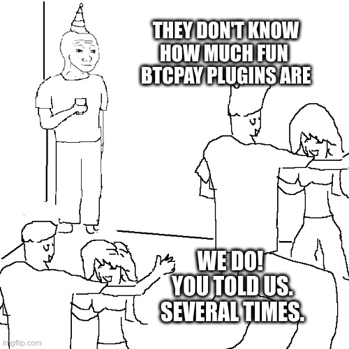
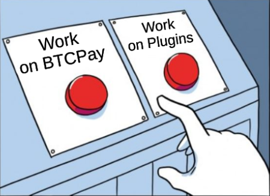
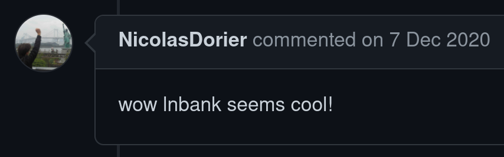
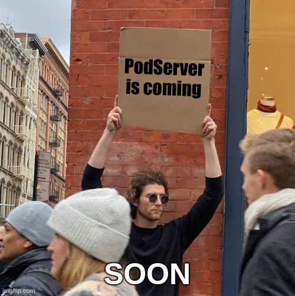
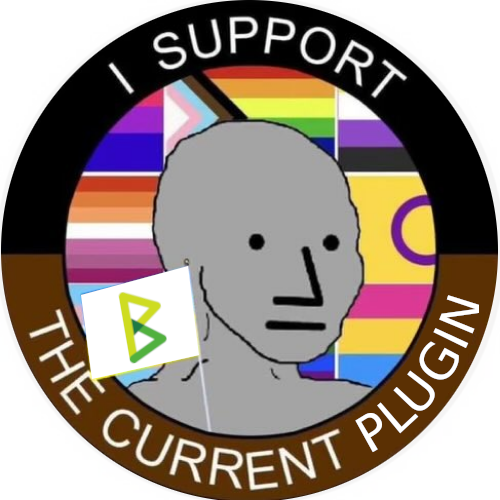
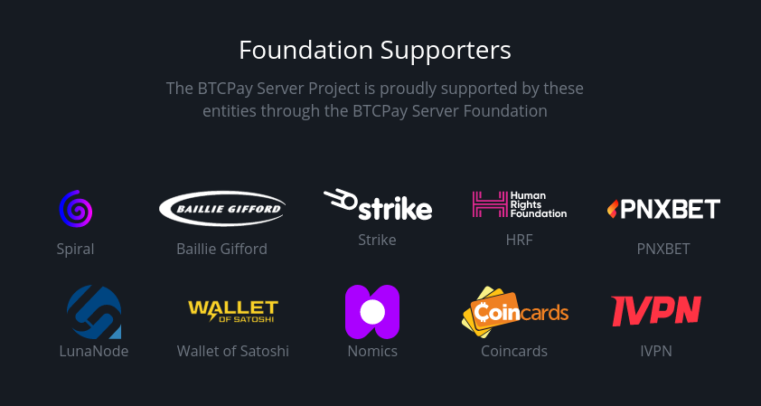

# **LNbank and PodServer**

Use Cases for BTCPay Server Plugins

&nbsp;

BTCPay Server Day
Baltic Honeybadger 2022, Riga

---

# Extending BTCPay Server is fun!

- Build on top of the existing infrastructure
- Solve non-core use cases
- Iterate quickly

---

---

# What is LNbank?

Custodial Lightning wallets on top of the BTCPay Lightning node.

Similar to LNbits and LNDhub, but BTCPay-native.

---

# Use cases

- Third-party hosts can grant Lightning access in custodial mode.
- "Uncle Jim" mode: Lightning wallets for your friends and family.
- Better accounting with separate LNbank wallets per store.
- Share wallet access between multiple users with different access levels.

---

---

# LNbank Demo

---

# Caveat and Risk Mitigation

The server admin acts as custodian, be aware of that trust relationship.

- Keep only small amount in the LNbank wallets.
- Regularly transfer funds to a Lightning node or account owned by yourself.
- Switch to your own BTCPay Server  once you start receiving larger payments.

---

# Features and Compatibility

Next Release &nbsp;**#twoweeks**

- LNURL-Pay and Lightning Address support
- Shared wallet access, supporting different access levels
- LNDhub-compatible API, wallets are usable with BlueWallet, Zeus and Alby

---

# Features and Compatibility

Longer Term

- LNURL-Withdraw support (e.g. for NFC cards)
- More admin features: Accounting, service fees
- Proof of Reserves

---

# Questions (not Q&A)

* Have you heard about podcasting?
* What about Podcasting 2.0?
* Using Podcasting 2.0?

---

# What is PodServer?

Self-host your podcast and start Podcasting 2.0 like a pro.

- Enjoy censorship resistance because you are in control of the feed and files.
- Earn sats using the Value 4 Value model and streaming payments.

---

# PodServer Demo

---

# Features and Compatibility

- Podcasting 2.0 tags: Value (podcast and episode level), Person, Season.
- Not just podcasts: Music, audiobooks, etc.
- Import existing feeds.

---

---

# Thank you, peers!

---

